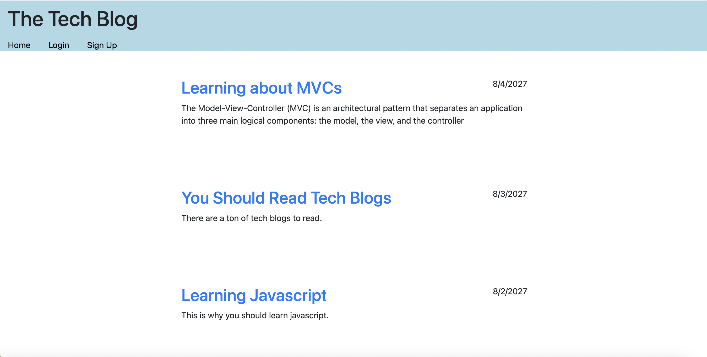

# Tech Blog

    
## Description

This application is a simple tech blog. It allows a user to login, signup, and create blog posts via their dashboard page. They can also read blog posts on the homepage either signed in or signed out. THe application also allows for comments to be added to blog posts. 

deployed link: https://mvc-tech-blog-mdillon.herokuapp.com/

]

## Table of Contents

* [Installation](#installation)
* [Usage](#usage)
* [Credits](#credits)
* [License](#license)
* [Contributing](#contributing)
* [Tests](#tests)
* [Questions](#questions)

## Installation

    "bcrypt": "^5.0.1",
    "connect-session-sequelize": "^7.1.4",
    "dotenv": "^16.0.1",
    "express": "^4.18.1",
    "express-handlebars": "^6.0.6",
    "express-session": "^1.17.3",
    "mysql2": "^2.3.3",
    "sequelize": "^6.21.3"

## Usage

This applicaiton can be used as a cms for someone wanting to have their own tech blog. It utilizes mysql to store user information so loggedin users can see a dashboard with all their posts and the ability to add a new post. New users can signup via the signup form which will then save their login for future logins.

Users can also interact with posts by adding comments to any of the blog posts on the website. 

## License

This is covered under the MIT license. 

## Questions

### Github Username
mardill: [https://github.com/mardill](https://github.com/mardill)

### Email

     
